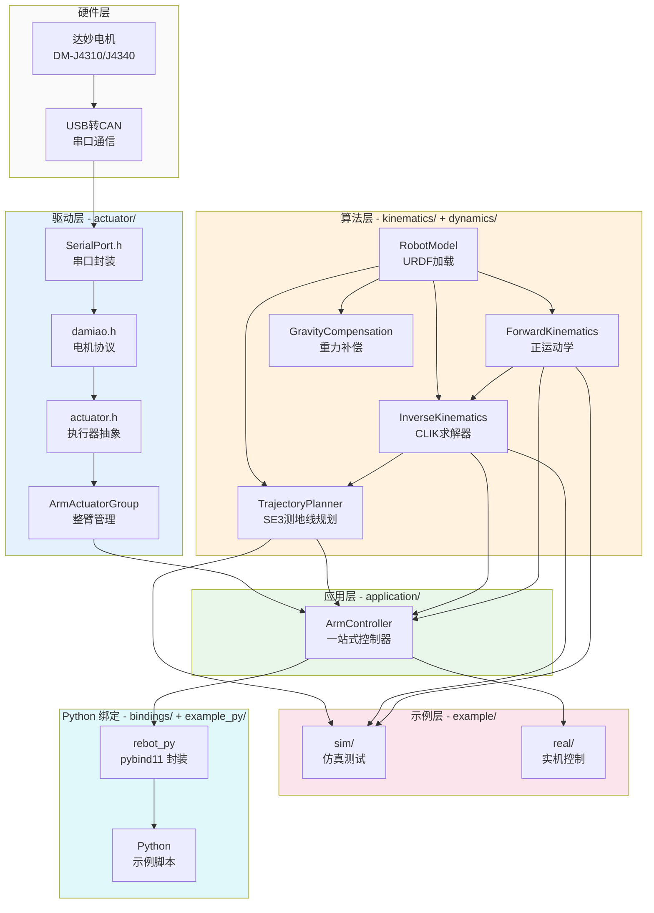
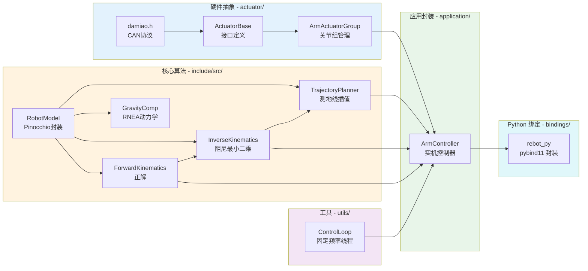
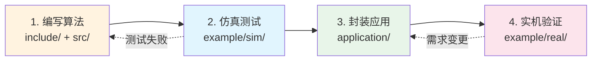

# reBotArm_control

基于 Pinocchio 的机械臂控制框架，提供从底层运动学算法到高层应用接口的完整解决方案。

## 项目简介

本项目为机械臂开发提供分层架构：
- **算法层**（`include/` + `src/`）：运动学、动力学、轨迹规划的核心算法
- **仿真层**（`example/sim/`）：MeshCat 3D 可视化，用于算法测试和参数调优
- **应用层**（`application/`）：`ArmController` 一站式封装，集成硬件驱动和算法
- **实机层**（`example/real/`）：实际控制示例，适合快速上手和应用开发

## 架构设计

### 系统分层架构



### 模块依赖关系



## 开发流程（作者视角）



**典型开发流程：**

1. **include/ + src/**：编写电机配置（`config/arm.yaml`）和核心算法（运动学、动力学）
2. **example/sim/**：在 MeshCat 仿真环境中测试算法，验证轨迹规划、IK 求解等
3. **application/**：将测试通过的算法封装到 `ArmController`，集成硬件驱动
4. **example/real/**：编写实机控制案例，供最终用户参考和二次开发

## 目录结构

```
reBotArm_control/
├── include/                    # 核心算法头文件
│   ├── kinematics/            # 运动学模块
│   │   ├── robot_model.h              # 机器人模型（Pinocchio 封装）
│   │   ├── forward_kinematics.h       # 正运动学（FK）
│   │   ├── inverse_kinematics.h       # 逆运动学（CLIK 阻尼最小二乘）
│   │   └── trajectory_planner_geodesic.h  # 测地线轨迹规划
│   ├── dynamics/              # 动力学模块
│   │   └── gravity_compensation.h     # 重力补偿（基于 RNEA）
│   ├── actuator/              # 执行器驱动
│   │   ├── actuator.h                 # 执行器抽象接口
│   │   ├── arm_actuator_group.h       # 整臂关节组管理
│   │   └── dm_hw/u2can/               # 达妙电机 USB-CAN 协议
│   ├── application/           # 应用层封装
│   │   └── arm_controller.h           # 实机控制器（推荐使用）
│   └── utils/                 # 工具模块
│       └── control_loop.h             # 固定频率控制循环
├── src/                        # 算法实现（.cpp）
│   ├── kinematics/
│   ├── dynamics/
│   ├── actuator/
│   └── application/
├── bindings/                   # Python 绑定（pybind11）
│   └── rebot_py.cpp                   # 生成 `rebot_py` 模块
├── example_py/                 # Python 示例（使用 rebot_py）
│   ├── ik_fk_demo.py                  # FK/IK/轨迹/重力补偿算法演示
│   ├── arm_traj_ctrl.py               # 交互式测地线轨迹控制
│   └── arm_state_monitor.py           # 只读关节状态监视
├── example/                    # 示例程序
│   ├── sim/                   # 仿真测试（算法验证）
│   │   ├── viz_bridge.h              # C++ ↔ Python 管道通信桥
│   │   ├── viewer.py                 # MeshCat 渲染进程
│   │   ├── ik_viz.cpp                # 交互式 IK 可视化
│   │   ├── traj_sim_geodesic.cpp     # 测地线轨迹测试
│   │   ├── traj_sim_circle.cpp       # 圆形轨迹演示
│   │   └── traj_sim_cone.cpp         # 圆锥姿态演示
│   └── real/                  # 实机控制（用户入口）
│       ├── arm_state_monitor.cpp     # 关节状态监视
│       ├── arm_traj_ctrl.cpp         # 交互式轨迹控制
│       ├── arm_traj_triangle.cpp     # 三角形路径演示
│       ├── arm_web_ctrl.cpp          # Web 拖动控制
│       └── gravity_comp_single_joint_test.cpp  # 重力补偿测试
├── config/                     # 配置文件
│   └── arm.yaml                      # 电机参数配置
└── urdf/                       # 机器人模型描述
    └── reBot-DevArm_fixend_description/
```

## 使用指南

### 快速上手（推荐）：example/real/

**适用人群**：比赛、项目开发、快速原型验证

`example/real/` 目录包含基于 `ArmController` 的实机控制示例。`ArmController` 已经完整封装了硬件驱动、运动学算法和轨迹规划，用户只需调用简单的 API 即可实现复杂的运动控制。

**最简使用示例**：

```cpp
#include "application/arm_controller.h"

int main() {
    rebot::ArmController arm;
    
    // 初始化：连接硬件、加载模型、启动控制循环
    arm.init("/dev/ttyACM0", "config/arm.yaml", "urdf/robot.urdf");
    
    // 移动到目标位姿（测地线轨迹，自动规划）
    arm.move_to_geodesic(rebot::ArmController::pose(0.4, 0, 0.3, M_PI, 0, 0));
    
    // 依次经过多个路径点
    arm.move_through_geodesic({
        rebot::ArmController::pose(0.4, 0.1, 0.3),
        rebot::ArmController::pose(0.4, -0.1, 0.3),
        rebot::ArmController::pose(0.4, 0, 0.3)
    });
    
    // 等待运动完成（支持 Ctrl+C 中断）
    while (arm.running()) {
        std::this_thread::sleep_for(std::chrono::milliseconds(100));
    }
    
    // 回零并关闭
    arm.shutdown();
    return 0;
}
```

**推荐示例程序**：

| 程序 | 功能 | 适用场景 |
|------|------|----------|
| `arm_traj_ctrl.cpp` | 交互式轨迹控制 | 手动测试、路径规划验证 |
| `arm_traj_triangle.cpp` | 三角形路径演示 | 理解 `move_through_geodesic` 用法 |
| `arm_state_monitor.cpp` | 只读状态监视 | 调试、标定、状态查看 |
| `arm_web_ctrl.cpp` | Web 拖动控制 | 远程控制、多关节调试 |
| `gravity_comp_single_joint_test.cpp` | 单关节重力补偿 | 验证动力学模型 |

**编译运行**：

```bash
cd build
cmake ..
make
sudo ./arm_traj_ctrl /dev/ttyACM0 ../config/arm.yaml ../urdf/robot.urdf
```

### Python 控制：example_py/

**适用人群**：习惯 Python 开发、需要快速脚本化控制的用户

通过 pybind11 封装，`ArmController` 以及所有底层运动学算法均可从 Python 直接调用。编译后会生成 `build/rebot_py.cpython-*.so`，位于 `build/` 目录。

**前提**：
```bash
conda activate pinocchio
cd build && cmake .. && make rebot_py -j$(nproc)
```

**推荐示例**：

| 程序 | 功能 | 需要实机 |
|------|------|----------|
| `ik_fk_demo.py` | FK/IK/轨迹规划/重力补偿纯算法演示 | 否 |
| `arm_traj_ctrl.py` | 交互式末端位姿输入 + 测地线轨迹执行 | 是 |
| `arm_state_monitor.py` | 50Hz 只读关节状态监视 | 是 |

**快速上手**：
```python
import rebot_py
import math

# 加载模型
robot = rebot_py.RobotModel("../urdf/.../reBot-DevArm_fixend.urdf")

# 正/逆运动学
q = robot.neutral_config()
T = rebot_py.compute_fk(robot, q)
ik = rebot_py.solve_ik(robot, rebot_py.make_pose(0.4, 0, 0.3, math.pi, 0, 0), q)
print(ik)

# 关节轨迹规划
traj = rebot_py.plan_joint_space_trajectory(robot, q, ik.q, 2.0)

# 实机控制
arm = rebot_py.ArmController()
arm.init("/dev/ttyACM0")
arm.move_to_geodesic(rebot_py.make_pose(0.4, 0, 0.3, math.pi, 0, 0))
arm.shutdown()
```

### 算法测试：example/sim/

**适用人群**：算法开发者、研究人员、需要理解底层原理的开发者

`example/sim/` 目录包含纯算法仿真程序，**不依赖实际硬件**，直接调用底层运动学 API（`RobotModel`、`solveIK`、`planJointSpaceTrajectory` 等）。所有程序自动启动 MeshCat 3D 可视化，可在浏览器中实时观察机械臂运动。

**核心特点**：
- 无需硬件连接，纯软件仿真
- 不经过 `ArmController`，直接测试底层算法
- 实时可视化，便于参数调优和效果对比

**仿真程序列表**：

| 程序 | 功能 | 学习重点 |
|------|------|----------|
| `ik_viz.cpp` | 交互式 IK 求解 | 理解正/逆运动学、工作空间可达性 |
| `traj_sim_geodesic.cpp` | 测地线轨迹规划 | 轨迹统计分析、性能测试 |
| `traj_sim_circle.cpp` | 圆形轨迹闭环 | 连续运动、IK 初值策略 |
| `traj_sim_cone.cpp` | 圆锥姿态变换 | 笛卡尔插值、姿态规划 |

**运行示例**：

```bash
cd build
make
./ik_viz ../urdf/robot.urdf

# 在终端输入目标位姿：
# 输入: 0.4 0 0.3        （位置）
# 输入: 0.4 0 0.3 3.14 0 0  （位置 + 姿态）
```

**通信机制**：

所有仿真程序使用 `viz_bridge.h` 提供的管道通信：
- C++ 程序自动 fork Python 子进程（`viewer.py`）
- 通过 pipe 发送 JSON 指令（一行一条）
- Python 使用 Pinocchio + MeshCat 渲染 3D 场景
- 浏览器实时显示（通常在 `http://127.0.0.1:7000/static/`）

### 核心模块说明

#### 1. kinematics/ - 运动学模块

| 文件 | 功能 |
|------|------|
| `robot_model.h` | Pinocchio 模型封装，提供关节限位、中位配置等 |
| `forward_kinematics.h` | 正运动学：关节角 → 末端位姿 |
| `inverse_kinematics.h` | 逆运动学：末端位姿 → 关节角（CLIK 算法）|
| `trajectory_planner_geodesic.h` | SE(3) 测地线轨迹规划，支持最小加加速度曲线 |

#### 2. actuator/ - 硬件驱动模块

| 文件 | 功能 |
|------|------|
| `actuator.h` | 执行器抽象接口（MIT 模式、位置模式、速度模式等）|
| `arm_actuator_group.h` | 整臂关节组管理（批量使能、设位置、读状态）|
| `dm_hw/u2can/damiao.h` | 达妙电机 USB-CAN 协议实现 |
| `dm_hw/u2can/SerialPort.h` | Linux 串口通信封装 |

配置文件：`config/arm.yaml` 定义各关节的电机类型、ID、控制参数等。

#### 3. application/ - 应用封装层

`ArmController` 是**推荐的实机控制入口**，集成了：
- 机器人模型加载（URDF）
- 硬件初始化和使能
- 1kHz 固定频率控制循环
- 高层运动 API（`move_to_geodesic`、`move_to_ik`、`move_through_geodesic` 等）
- 信号处理（Ctrl+C 安全停止）

**适用场景**：大学生竞赛、工业应用、快速开发

#### 4. dynamics/ - 动力学模块

`GravityCompensator`：基于 Pinocchio RNEA 算法计算重力补偿力矩，可与 MIT 模式结合实现柔顺控制。

## 开发者工作流

### 作为库的使用者（推荐）

**目标**：快速实现机械臂应用

1. 直接使用 `example/real/` 中的示例
2. 参考 `ArmController` API 文档（见 `include/application/arm_controller.h` 头部注释）
3. 只需修改目标位姿和路径，无需关心底层实现

### 作为算法开发者

**目标**：改进运动学算法、添加新规划器

1. 在 `include/kinematics/` 或 `include/dynamics/` 中编写新算法
2. 对应的 `src/` 目录下实现
3. 在 `example/sim/` 中编写测试程序：
   - 直接调用底层 API（不经过 `ArmController`）
   - 使用 `viz_bridge.h` 连接 MeshCat 可视化
   - 测试各种边界条件和参数组合
4. 测试通过后，集成到 `ArmController`
5. 在 `example/real/` 中编写实机验证案例

### 作为贡献者

遵循上述开发流程，确保：
- 新算法先在 `sim/` 中充分测试
- 封装到 `application/` 时保持 API 一致性
- 提供 `real/` 示例展示实际用法

## 编译与依赖

**依赖项**：
- C++17 或更高
- Pinocchio（运动学库）
- Eigen3（线性代数）
- Python 3 + meshcat + pinocchio（仅 sim 需要）

**编译**：

```bash
mkdir build && cd build
cmake ..
make -j$(nproc)
```

**生成的可执行文件和模块**：
- `build/ik_viz`、`build/traj_sim_*` - 仿真程序
- `build/arm_*` - 实机控制程序
- `build/rebot_py.cpython-*.so` - Python 绑定模块（可被 `example_py/` 中的脚本导入）

## 参数配置

### config/arm.yaml

定义每个关节的：
- 电机类型（`DM_J4310`、`DM_J4340` 等）
- CAN 总线 ID（`slave_id`、`master_id`）
- 控制参数（`mit_kp`、`mit_kd`、控制模式等）

### URDF 模型

位于 `urdf/` 目录，定义：
- 连杆尺寸和质量
- 关节类型和限位
- 视觉和碰撞几何

## 常见使用场景

### 场景 1：快速项目实现

**推荐路径**：直接使用 `ArmController`

```cpp
// 示例：抓取任务
ArmController arm;
arm.init();

// 移动到抓取位置
arm.move_to_geodesic(pose(0.3, 0.1, 0.05, M_PI, 0, 0));
// ... 夹爪操作 ...

// 移动到放置位置
arm.move_to_geodesic(pose(0.3, -0.1, 0.05, M_PI, 0, 0));

arm.shutdown();
```

### 场景 2：算法研究（新轨迹规划器）

**推荐路径**：在 `sim/` 中测试，参考现有示例

```cpp
// 参考 traj_sim_geodesic.cpp 的结构
#include "viz_bridge.h"

RobotModel robot(urdf_path);
Eigen::VectorXd q = robot.neutralConfig();

// 测试你的新算法
auto traj = your_new_planner(robot, start, goal);

// 可视化结果
Pipe viz;
rebot::sim::spawn(&viz, urdf_path.c_str());
rebot::sim::send_line(&viz, rebot::sim::pack_traj_json(robot, "test", 0.02, traj));
```

### 场景 3：参数调优

**推荐路径**：在 `sim/` 中对比不同参数

1. 修改 `viz_bridge.h` 中的 `DefaultIKParams`
2. 运行仿真程序观察效果
3. 在 `traj_sim_geodesic.cpp` 中查看统计数据（耗时、成功率、误差）

### 场景 4：Python 快速脚本

**推荐路径**：使用 `rebot_py` Python 绑定

无需编译 C++，直接编写 Python 脚本调用运动学算法和实机控制：

```python
import rebot_py
import numpy as np

# 加载模型（无需硬件）
robot = rebot_py.RobotModel("urdf/.../reBot-DevArm_fixend.urdf")
q = robot.neutral_config()

# IK 求解
target = rebot_py.make_pose(0.4, 0, 0.3, 3.14, 0, 0)
result = rebot_py.solve_ik(robot, target, q)
print(result.q)

# 关节轨迹
traj = rebot_py.plan_joint_space_trajectory(robot, q, result.q, 2.0)

# 实机控制（如已编译 rebot_py）
arm = rebot_py.ArmController()
arm.init("/dev/ttyACM0")
arm.move_to_ik(target)   # 快速一步到位（无轨迹插值）
arm.move_to_geodesic(target)  # 平滑轨迹运动
arm.shutdown()
```

## 常见问题

### Q: 仿真和实机有什么区别？

- **sim/**：纯算法测试，无硬件依赖，直接调用运动学 API
- **real/**：连接实际电机，使用 `ArmController` 封装，包含硬件安全保护
- **Python（example_py/）**：通过 pybind11 调用同样的运动学算法，部分脚本无需硬件（纯算法演示），实机控制脚本需要 sudo 访问串口

### Q: move_to_geodesic 和 move_to_ik 有什么区别？

- `move_to_geodesic`：先做 IK 求解，再进行关节空间轨迹规划，末端平滑运动，推荐用于日常控制
- `move_to_ik`：只做一次 IK 求解，直接下发关节角，无轨迹插值，适合快速点位修正（注意：无平滑过程，对关节间隙大的机械臂可能有抖动）

### Q: 为什么要分 sim 和 real？

- **开发效率**：算法在仿真中快速迭代，避免频繁上实机测试
- **安全性**：危险参数先在仿真中验证，再上实机
- **教学友好**：学习者可以先在仿真中理解原理，再操作实机

### Q: 如何添加新的控制模式？

1. 在 `include/kinematics/` 中实现算法
2. 在 `example/sim/` 中创建测试程序（参考现有示例）
3. 测试通过后，在 `ArmController` 中添加对应接口（如 `move_to_XXX`）
4. 在 `example/real/` 中编写使用案例

## 许可证

MIT License

## 贡献

欢迎提交 Issue 和 Pull Request！请遵循上述开发流程，确保代码经过仿真测试。